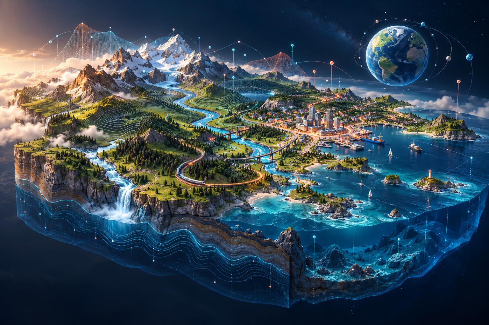
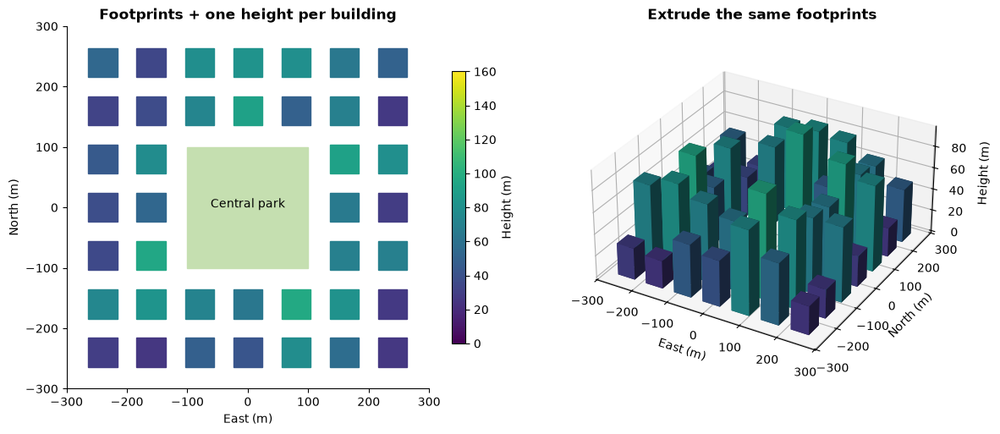
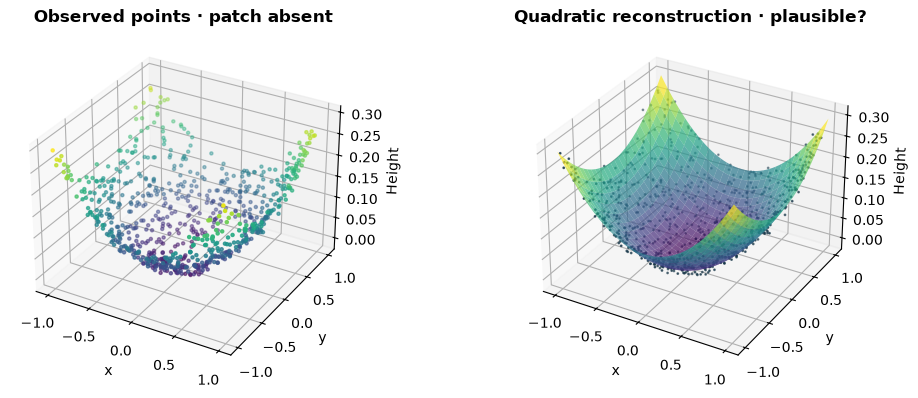
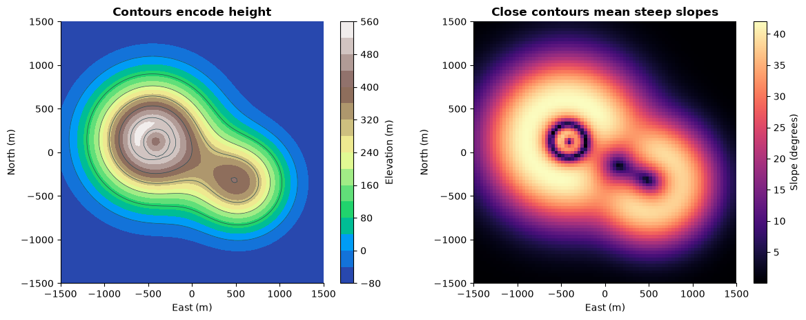
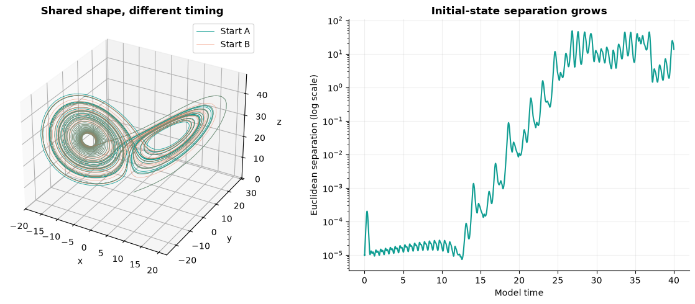

# JupyterLite Astra Demos



**See the idea. Change the world. Understand the model.**

A browser-based learning gallery for geospatial reasoning, visual explanations, animation and procedural 3D world creation, inspired by [Awesome GPT-6 Astra](https://github.com/magiccreator-ai/awesome-gpt-6-astra). **16 notebooks · 6 interactive 3D scenes · no API keys.**

[**Read the Jupyter Book →**](https://jltobias.github.io/JupyterLite-Astra-demos/) · [**Open JupyterLite notebooks →**](https://jltobias.github.io/JupyterLite-Astra-demos/lite/lab/index.html) · [**Explore the 3D World Lab →**](https://jltobias.github.io/JupyterLite-Astra-demos/demos/)

## Live Jupyter Book and notebooks

| Site | Live link | What you can do |
|---|---|---|
| **Jupyter Book** | [Read the complete book](https://jltobias.github.io/JupyterLite-Astra-demos/) | Browse the introduction and all 16 notebook chapters, with explanations and saved figures. |
| **JupyterLite** | [Launch the notebook environment](https://jltobias.github.io/JupyterLite-Astra-demos/lite/lab/index.html) | Run and edit all 16 Python notebooks directly in your browser. |
| **3D World Lab** | [Explore the interactive demos](https://jltobias.github.io/JupyterLite-Astra-demos/demos/) | Orbit and manipulate six 3D scenes without starting a Python kernel. |

Start with the [Jupyter Book learning guide](https://jltobias.github.io/JupyterLite-Astra-demos/start-here/) or [run that guide in JupyterLite](https://jltobias.github.io/JupyterLite-Astra-demos/lite/lab/index.html?path=00_start_here.ipynb). The book groups the lessons into **Motion and systems**, **Maps and spatial reasoning**, and **World creation and uncertainty**. Individual notebook launch links appear in the gallery below.

> These are original educational reinterpretations and extensions. They do not reproduce creators' code, prompts, assets or benchmark results, and do not establish the limits of GPT-6 Astra's capabilities. The upstream directory contains creator-reported demonstrations. Our cities, terrain, sensor readings and simulations are synthetic unless explicitly described otherwise; a convincing rendering is not evidence of geographic accuracy. Running these demos does not call an AI model.

## Explore a world, then open its notebook

The World Lab runs directly in your browser with a locally bundled Three.js renderer. Drag to orbit, scroll to zoom, or focus the scene and use arrow keys and `+` / `−`. Motion starts **paused**; select **Play motion** for the globe, ocean or attractor. Every scene has labeled controls, a prediction question, an explanation and a notebook link. Static notebook plots provide an alternative when WebGL is unavailable.

| Live 3D scene | Change something | Discover |
|---|---|---|
| [Terrain & connected water](https://jltobias.github.io/JupyterLite-Astra-demos/demos/?scene=terrain) | Water level, vertical exaggeration | How elevation and connectivity determine wet cells |
| [Procedural city](https://jltobias.github.io/JupyterLite-Astra-demos/demos/?scene=city) | Building height, sun elevation | Footprints become buildings; geometry casts shadows |
| [Globe & great-circle routes](https://jltobias.github.io/JupyterLite-Astra-demos/demos/?scene=globe) | Route progress, coordinate-grid opacity | Spherical distance and the cost of flattening a globe |
| [Ocean in motion](https://jltobias.github.io/JupyterLite-Astra-demos/demos/?scene=ocean) | Wave amplitude, animation speed | Superposition creates a moving surface |
| [Voxel island](https://jltobias.github.io/JupyterLite-Astra-demos/demos/?scene=voxel) | Waterline, terrain relief | Continuous fields become occupied cells and materials |
| [Lorenz attractor](https://jltobias.github.io/JupyterLite-Astra-demos/demos/?scene=chaos) | Convection parameter, visible trajectory | Close starting states can follow different futures |

The Jupyter Book, JupyterLite notebooks and World Lab are published together by the GitHub Pages workflow. Creator-hosted demonstrations are linked separately below and in the notebooks.

## Notebook gallery

Open a notebook, wait for **Python (Pyodide)** to load, and choose **Run → Run All Cells**. First use needs an internet connection to download JupyterLite, Python and its packages. There are no runtime map-tile services or API keys. Real Natural Earth coastlines are bundled locally with provenance. Calculations use NumPy, Matplotlib and the bundled `astra_utils.py` helper. Offline availability of the notebook runtime depends on your browser cache; it is not guaranteed.

Every lesson pairs **observe → predict → change → explain** with labeled visuals, parameter experiments and a discussion of what the model leaves out. Notebook files include executed plots for reading on GitHub and in the book. Run animation cells in JupyterLite for playable output.

| Notebook source | Visual learning focus | Run in JupyterLite | Inspiration / attribution |
|---|---|---|---|
| [00 · Start here](content/notebooks/00_start_here.ipynb) | The same field as raster, contours and surface | [Launch](https://jltobias.github.io/JupyterLite-Astra-demos/lite/lab/index.html?path=00_start_here.ipynb) | Original learning guide |
| [01 · Aquarium motion](content/notebooks/01_aquarium_motion.ipynb) | Scrubbable motion, centroid paths and cohesion | [Launch](https://jltobias.github.io/JupyterLite-Astra-demos/lite/lab/index.html?path=01_aquarium_motion.ipynb) | Tim Jayas · [Reference-Image Aquarium Game](https://github.com/magiccreator-ai/awesome-gpt-6-astra#reference-image-aquarium-game) |
| [02 · Robot duel](content/notebooks/02_robot_duel.ipynb) | Arena animation, contact events and energy state | [Launch](https://jltobias.github.io/JupyterLite-Astra-demos/lite/lab/index.html?path=02_robot_duel.ipynb) | ハヤシモン · [Universe Duel](https://github.com/magiccreator-ai/awesome-gpt-6-astra#universe-duel) |
| [03 · Procedural train](content/notebooks/03_procedural_train.ipynb) | Component diagrams and exploded 3D assemblies | [Launch](https://jltobias.github.io/JupyterLite-Astra-demos/lite/lab/index.html?path=03_procedural_train.ipynb) | Tom Krcha · [Procedural Train Assemblies](https://github.com/magiccreator-ai/awesome-gpt-6-astra#procedural-train-assemblies) |
| [04 · Glass drying](content/notebooks/04_glass_drying.ipynb) | Decay curves, component areas and sensitivity heatmaps | [Launch](https://jltobias.github.io/JupyterLite-Astra-demos/lite/lab/index.html?path=04_glass_drying.ipynb) | Barron Roth · [Glass-Drying Physics Simulation](https://github.com/magiccreator-ai/awesome-gpt-6-astra#glass-drying-physics-simulation) |
| [05 · Model railroad](content/notebooks/05_model_railroad.ipynb) | Timetables, track topology and occupancy conflicts | [Launch](https://jltobias.github.io/JupyterLite-Astra-demos/lite/lab/index.html?path=05_model_railroad.ipynb) | Probably Nick · [Interactive Model Railroad](https://github.com/magiccreator-ai/awesome-gpt-6-astra#interactive-model-railroad) |
| [06 · Globe & projections](content/notebooks/06_globe_projections.ipynb) | Equal Earth, Mercator, graticules and 3D routes | [Launch](https://jltobias.github.io/JupyterLite-Astra-demos/lite/lab/index.html?path=06_globe_projections.ipynb) | stevwang.dev · [Equal Earth Map](https://github.com/magiccreator-ai/awesome-gpt-6-astra#equal-earth-map) |
| [07 · Terrain & water](content/notebooks/07_terrain_water.ipynb) | Elevation, slope, connected water and area curves | [Launch](https://jltobias.github.io/JupyterLite-Astra-demos/lite/lab/index.html?path=07_terrain_water.ipynb) | Sonia · [Tidal Garden Ocean Guide](https://github.com/magiccreator-ai/awesome-gpt-6-astra#tidal-garden-ocean-guide); original terrain extension |
| [08 · 3D neighborhood](content/notebooks/08_neighborhood_3d.ipynb) | Coordinates, footprints, extrusion and GeoJSON export | [Launch](https://jltobias.github.io/JupyterLite-Astra-demos/lite/lab/index.html?path=08_neighborhood_3d.ipynb) | Pietro Schirano · [Map Pin to 3D Neighborhood](https://github.com/magiccreator-ai/awesome-gpt-6-astra#map-pin-to-3d-neighborhood); synabreu · [Seoul 3D Atlas](https://github.com/magiccreator-ai/awesome-gpt-6-astra#seoul-3d-atlas) |
| [09 · Route networks](content/notebooks/09_route_networks.ipynb) | Weighted graph search, bridges and accessibility maps | [Launch](https://jltobias.github.io/JupyterLite-Astra-demos/lite/lab/index.html?path=09_route_networks.ipynb) | Original geospatial extension of [Interactive Model Railroad](https://github.com/magiccreator-ai/awesome-gpt-6-astra#interactive-model-railroad) |
| [10 · Ocean flow](content/notebooks/10_ocean_flow.ipynb) | Streamlines, particle animation and 3D wave fields | [Launch](https://jltobias.github.io/JupyterLite-Astra-demos/lite/lab/index.html?path=10_ocean_flow.ipynb) | Thomas Ricouard · [Sunwake](https://github.com/magiccreator-ai/awesome-gpt-6-astra#sunwake-sailing-game); ashe · [Navier–Stokes Visual Essay](https://github.com/magiccreator-ai/awesome-gpt-6-astra#navierstokes-visual-essay) |
| [11 · Point-cloud repair](content/notebooks/11_point_cloud_repair.ipynb) | Missing geometry, fitted surfaces and hidden error | [Launch](https://jltobias.github.io/JupyterLite-Astra-demos/lite/lab/index.html?path=11_point_cloud_repair.ipynb) | Toyoshi · [3D Scan Patch for Printing](https://github.com/magiccreator-ai/awesome-gpt-6-astra#3d-scan-patch-for-printing) |
| [12 · Voxel world](content/notebooks/12_voxel_world.ipynb) | Height maps, material rules and volume budgets | [Launch](https://jltobias.github.io/JupyterLite-Astra-demos/lite/lab/index.html?path=12_voxel_world.ipynb) | Flavio Adamo · [Minecraft-Style World](https://github.com/magiccreator-ai/awesome-gpt-6-astra#minecraft-style-world) |
| [13 · Lorenz chaos](content/notebooks/13_lorenz_chaos.ipynb) | 3D attractors, paired animation and convergence | [Launch](https://jltobias.github.io/JupyterLite-Astra-demos/lite/lab/index.html?path=13_lorenz_chaos.ipynb) | Juy / AI experiments · [Lorenz Chaos Explorer](https://github.com/magiccreator-ai/awesome-gpt-6-astra#lorenz-chaos-explorer) |
| [14 · Spatial interpolation](content/notebooks/14_spatial_interpolation.ipynb) | Sensor maps, interpolation, support and held-out error | [Launch](https://jltobias.github.io/JupyterLite-Astra-demos/lite/lab/index.html?path=14_spatial_interpolation.ipynb) | Original spatial-analysis extension, connected to [Seoul 3D Atlas](https://github.com/magiccreator-ai/awesome-gpt-6-astra#seoul-3d-atlas) |
| [15 · Sunlight & shadows](content/notebooks/15_sunlight_shadows.ipynb) | Shadow maps, sun direction and height relationships | [Launch](https://jltobias.github.io/JupyterLite-Astra-demos/lite/lab/index.html?path=15_sunlight_shadows.ipynb) | SuSu_酥酥👅 · [Hangzhou in Three.js](https://github.com/magiccreator-ai/awesome-gpt-6-astra#hangzhou-in-threejs) |

### A few views from the notebooks

| Map → world | Evidence → explanation |
|---|---|
|  |  |
|  |  |

## Choose a learning route

- **New to notebooks?** 00 → 01 → 03 → 08: see, animate, assemble, extrude.
- **Geospatial thinking:** 06 → 07 → 08 → 09 → 14: coordinates, raster terrain, vector features, networks, uncertainty.
- **3D world creation:** 03 → 08 → 10 → 12 → 15: components, cities, water, voxel materials, lighting.
- **Models and evidence:** 04 → 11 → 13 → 14: assumptions, reconstruction error, chaos, validation.

Use each notebook's prediction question before touching its parameters. Change one input at a time, keep the seed fixed, compare the linked views and explain the result. The aim is stronger spatial intuition and understanding through visual learning.

## Build and verify locally

Python 3.12+ and Node.js 24 are used by CI. Create and activate a virtual environment, then:

```bash
python -m pip install -r requirements-dev.txt
python scripts/build_notebooks.py
python scripts/execute_notebooks.py
python -m pytest -q
```

`lessons/*.py` are readable percent-format sources. The generator produces notebooks; the executor runs all cells in isolated temporary storage and writes back visible outputs and preview images only after every notebook succeeds. To execute without changing files, use `python scripts/execute_notebooks.py --check`. Keep `content/notebooks/astra_utils.py` beside notebooks copied elsewhere.

Build a local site at the root URL:

```bash
jupyter book build --html
jupyter lite build --contents content/notebooks --output-dir _build/html/lite --base-url /lite/
python scripts/copy_site_assets.py
python -m http.server 8000 --directory _build/html
```

Open `http://localhost:8000/` for the book, `/demos/` for the World Lab, or `/lite/lab/index.html` for JupyterLite. For a GitHub Pages project build, set `BASE_URL=/JupyterLite-Astra-demos` before the book command and use `--base-url /JupyterLite-Astra-demos/lite/`. In PowerShell use `$env:BASE_URL='/JupyterLite-Astra-demos'`; in Bash use `export BASE_URL=/JupyterLite-Astra-demos`.

Browser checks (after building):

```bash
python -m playwright install chromium
python scripts/check_browser.py --root _build/html
python scripts/check_jupyterlite.py --root _build/html
```

The browser tests start their own local servers. Use `--channel msedge` or `--channel chrome` to test an installed browser instead, and `--base-url /JupyterLite-Astra-demos` for a project-path build. The JupyterLite check runs aquarium motion, the real-coastline projections, GeoJSON export and Lorenz animation in Pyodide; initial package downloads need internet access. See [CONTRIBUTING.md](CONTRIBUTING.md) for maintenance. GitHub Actions executes notebooks, builds both sites, checks scenes and browser Python, and publishes on pushes to `main`; pull requests build and test without deploying.

## Sources and asset provenance

The [Awesome GPT-6 Astra community directory](https://github.com/magiccreator-ai/awesome-gpt-6-astra) was consulted on **October 2, 2026**. Each notebook retains creator attribution and original source links. Creator-hosted examples are independent projects; their availability and performance are not guaranteed by this repository. No upstream creator code, screenshots, 3D models or textures were copied.

- Splash artwork: generated with the built-in image-generation tool; [prompt and provenance](assets/README.md).
- Notebook previews: generated from this repository's executed scientific plots.
- Real geographic data: public-domain [Natural Earth land outlines and provenance](content/notebooks/data/README.md), bundled for projections and the globe.
- Three.js: locally vendored version 0.160.1, [MIT license and source record](demos/vendor/README.md).
- Projection math: [PROJ Equal Earth documentation](https://proj.org/en/stable/operations/projections/eqearth.html).
- Browser file access: [JupyterLite kernel filesystem documentation](https://jupyterlite.readthedocs.io/en/stable/howto/content/python.html).
